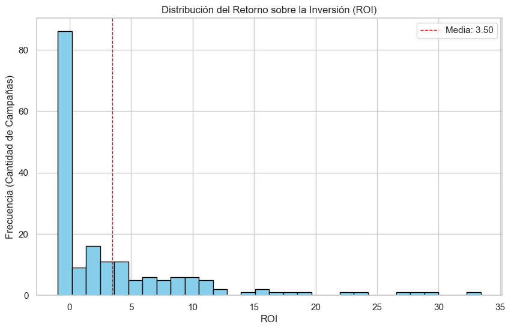
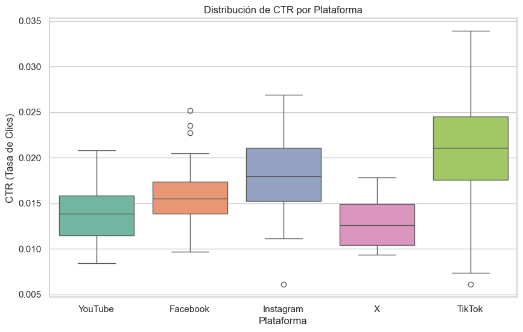
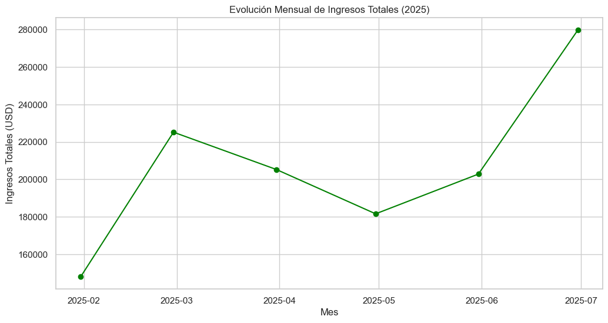

# Reporte de Analisis - Creatividad Digital

## 1. Contexto
- **Objetivo del analisis**: Evaluar el rendimiento de `180` campañas digitales para optimizar la inversión publicitaria basándose en rentabilidad y efectividad visual.
- **Fuente de datos**: `campanas_creatividad_digital.csv` y  `clientes.csv`.
- **Periodo analizado**: Año `2025`.

## 2. Limpieza y preparacion
- **Variables derivadas creadas**: Se calcularon cinco `KPIs` críticos: `CTR` (Tasa de clics), `CVR` (Tasa de conversión), `CPC` (Costo por clic), `CPM` (Costo por mil impresiones) y `ROI` (Retorno sobre inversión)
- **Supuestos y decisiones**: Se utilizó el método de Rango Intercuartílico (`IQR`) para identificar `12` campañas con `ROI` atípico y `3` con `CTR` excepcional, tratándolas como casos de éxito de viralidad.

## 3. Hallazgos estadisticos
- **KPI 1**: El retorno promedio es de `3.50`, aunque está influenciado por outliers de alto impacto.
- **KPI 2**: El formato `Reel` obtuvo la mayor efectividad visual promedio.
- **KPI 3**: La inversión analizada asciende a `$279,370.66` con ingresos de `$1,242,557.17`.

## 4. Filtros y segmentos relevantes
- **Segmento A**: (Riesgo) Campañas con `ROI` negativo y costo mayor a la mediana (concentradas mayormente en `YouTube`).
- **Segmento B**: (Oportunidad) `TikTok` e `Instagram` representan el Top `10` de campañas por rentabilidad.
- **Segmento C**: (Industria) Identificación del `ROI` promedio por sector tras realizar el merge con la tabla de clientes.

## 5. Graficas e interpretacion
1. **Grafica 1**: Muestra una distribución sesgada a la derecha, donde la mayoría de campañas son *estables* pero pocas generan *ingresos masivos*. 

2. **Grafica 2**: Confirma que `TikTok` no solo tiene el *mejor rendimiento promedio*, sino también la *mayor variabilidad y potencial de clics*.

3. **Grafica 3**: Revela un crecimiento sostenido de ingresos hacia *julio de `2025`* tras una caída estacional en *mayo*.

## 6. Insights accionables
1. **Viralidad en TikTok**: Los formatos verticales (`Reels` y `Stories`) en `TikTok` son los únicos que generan outliers de `ROI` superiores a `25.0`

2. **Ineficiencia en Video Largo**: Los formatos de larga duración en plataformas tradicionales muestran frecuentemente `ROI` *negativo* con costos elevados.

3. **Correlación Creativa**: Las campañas con alta *"Calificación Creativa"*  interna suelen coincidir con los outliers de `CTR` detectados.

## 7. Recomendaciones
1. **Reasignación de Presupuesto**: Migrar el `20%` del presupuesto de campañas con `ROI` negativo hacia el formato `Reel` en `TikTok` e `Instagram`.

2. **Auditoría de Creatividades**: Revisar las piezas de los `12` outliers de `ROI` para estandarizar sus elementos visuales en futuras campañas.

## 8. Anexo
- **Limitaciones de los datos**: El análisis no incluye el sentimiento de los comentarios de los usuarios, solo métricas cuantitativas.

- **Siguientes pasos**: Integrar datos de Customer Lifetime Value (CLV) para medir la rentabilidad a largo plazo por industria.
